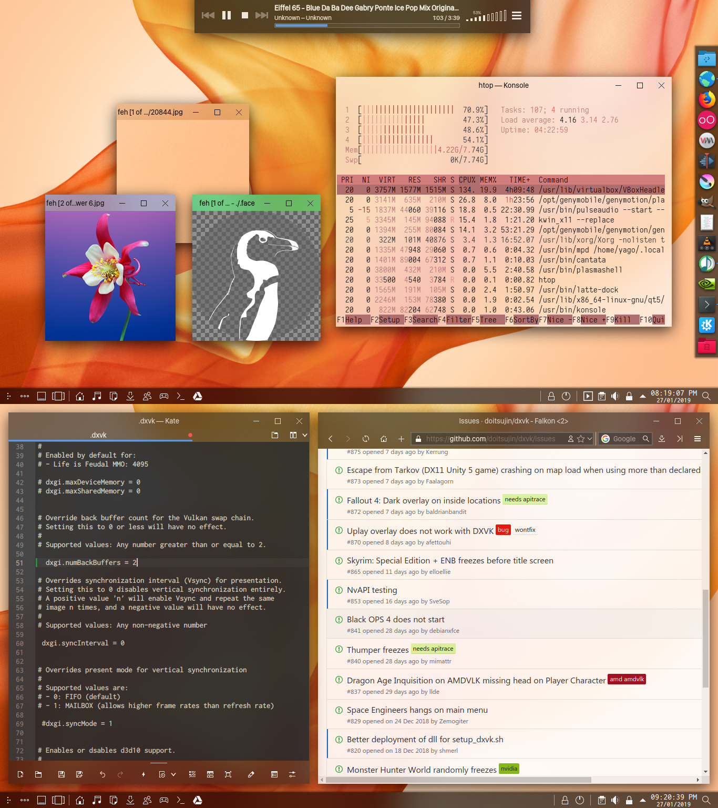

## material-decoration-bt
Material-styled window decoration theme for KWin. Resembles the decorations in Windows 10.
Extensive customization possible through src/Decoration.cc; theme also takes colors from the user's color scheme and KWin window rules.

Color theme recommended for use with the default settings:
Kvantum theme recommended for use with this theme overall:

### Installation

##### Prerequisites

* KDecoration2
* other KDE Framework 5 headers; see the output of ´make´
* cmake

##### Building from source

```
mkdir build
cd build
cmake -DCMAKE_INSTALL_PREFIX=/usr ..
make
sudo make install
```
